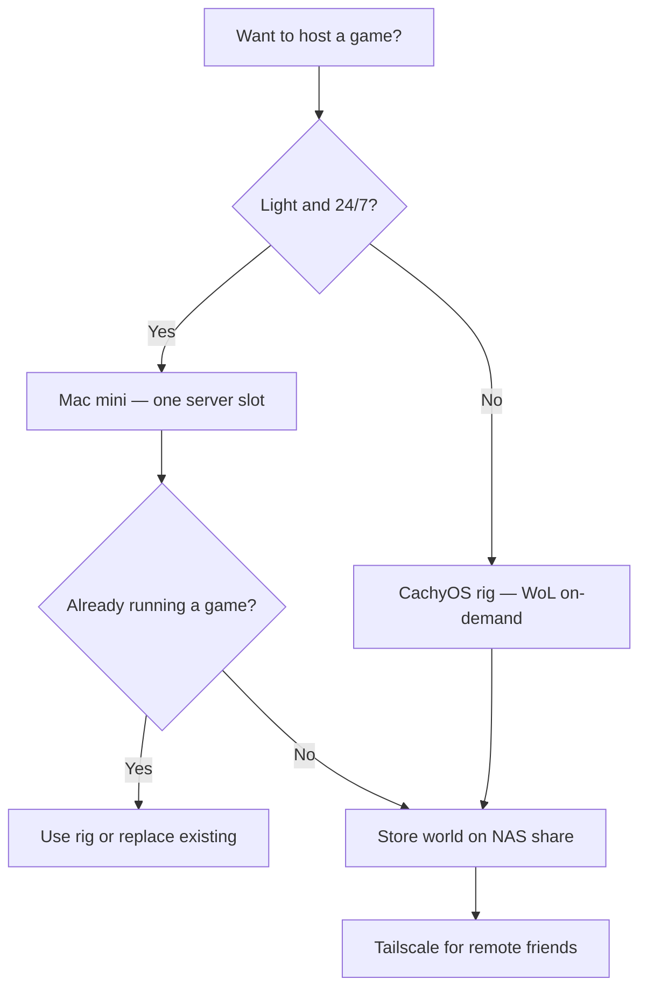

> Companion to [foss-setup-plan-2.md](../../../foss-setup-plan-2.md) §4 (Play — game servers): per-title feasibility and host assignment.

# Game Server Research Guide

A per-title feasibility reference for hosting private servers on the hardware defined in [foss-setup-plan-2.md](../../../foss-setup-plan-2.md) Section 4. Use this during **Phase 5 — Play** before committing to a host or uptime model.

**Scope:** Can you run a server for you and your friends? Each entry answers that with a verdict, network reach, uptime model, host assignment, and resource budget benchmarked against what is already running on that box.

---

## Legal disclaimer

- **Official dedicated servers** (Minecraft, Valheim, Dragonwilds, etc.) are fine to self-host for private use under the game's license terms.
- **Emulators** (FFXI LandSandBoat, WoW VMaNGOS/AzerothCore) violate publisher Terms of Service. This guide documents technical feasibility only — you must own a legitimate copy of the game client and accept the legal risk yourself.
- **Warcraft III** has no official persistent dedicated server; client-hosted and third-party tooling carry their own ToS considerations.

---

## Hardware reference

Grounded in [foss-setup-plan-2.md](../../../foss-setup-plan-2.md) Sections 0, 4, and 5.

| Host | Specs | Role (per plan) | Game-server fit |
|---|---|---|---|
| **Mac mini** → Ubuntu Server | i5-4278U, **8 GB** (fixed), ~12 W | Always-on Docker stack (Seerr, Miniflux, Navidrome, Caddy, AdGuard, LiteLLM ≤1B, Forgejo, etc.) + **one light game server** | **24/7 light servers only** — ~2–3 GB headroom after stack |
| **DS920+ NAS** | J4125, **20 GB** (after RAM upgrade) | Storage, Immich, Plex, CWA, Paperless-ngx, Dependency-Track, Frigate, Tdarr server, backups | **Avoid for game processes** — RAM headroom exists but CPU is weak and the box is already committed to ML indexing, Java (Paperless/DT), and live video; **use NAS for world/save storage**, not the server binary |
| **CachyOS rig** | 12th-gen i7, **64 GB RAM**, RTX 3090 Ti, ~90–120 W idle | On-demand: Sunshine, Ollama, **heavy game servers**, Tdarr transcode node | **Default for anything heavy** — wake via WoL; not 24/7 (~$160–210/yr if left on) |

**Host tags used per game:** `Yes` = fits the plan's load budget · `Marginal` = technically possible but fights existing services · `No` = wrong tool (RAM, CPU, Wine, or DSM limits).

### Mac mini capacity budget

```
Committed:  ~5–6 GB (Docker stack per Section 0)
Available:  ~2–3 GB for one game server
Safe 24/7:  Minecraft Paper (3 GB heap), Terraria (~512 MB), UT2004 (~512 MB)
Marginal:   TF2 (4 GB), Dragonwilds 2-player (4 GB), Halo CE (~1 GB)
Will OOM:   everything else
Rule:       ONE game only — never stack a second server here
Pelican:    Lives on Mac mini per Phase 5 — panel only, not a second game
```

### NAS (20 GB) capacity budget

```
Committed (post-upgrade plan):  Immich + ML, Plex, CWA, Paperless (Tika/Java),
                                Dependency-Track (~4 GB+ Java), Frigate, Tdarr server
Available for games:            Little spare RAM on paper; J4125 CPU is the real limit
DSM constraints:                No Wine; SteamCMD/32-bit titles painful; Container Manager only
Plan intent:                    Store game worlds/saves on NAS shares — run the server elsewhere
Could work (marginal):          Minecraft Paper in Docker (small world, schedule off Immich ML)
Will struggle:                  Valheim, anything Wine, emulators, CPU-heavy UE titles
Do not use:                     Palworld, Enshrouded, Abiotic Factor, FFXI/WoW (Java+DB pile-on)
```

### CachyOS rig capacity budget

```
When awake, typical game-night load:
  Game server:     2–24 GB depending on title
  Sunshine stream: GPU NVENC, ~0 extra RAM
  Ollama:          keep_alive=0 or off during games (Section 4 GPU policy)
  Headroom:        40+ GB remaining for most titles on this 64 GB box

Concurrent servers: hardware allows 2–3 light servers OR 1 heavy server,
  but plan policy is one session at a time for simplicity

Power: WoL before sessions; auto-suspend after idle (Section 5)
  Do NOT leave the rig on 24/7 just to host games
```

### GPU contention policy

The 3090 Ti serves Sunshine streaming, optional Ollama inference, and games that need Xvfb/OpenGL (Core Keeper, Wine titles). Set Ollama **`keep_alive=0`** and do not run inference during game or stream sessions.

---

## Network reference

From [foss-setup-plan-2.md](../../../foss-setup-plan-2.md) Sections 1, 4, and 7.

| Method | Label in this guide | When to use |
|---|---|---|
| Same Trusted VLAN (wired preferred) | **Over LAN** | In-home play; Moonlight/Sunshine discovery requires same VLAN |
| **Tailscale** tailnet (invite friends) | **Over the internet** | Default for remote friends — encrypted, no port-forward |
| Dream Wall port-forward or **Playit.gg** | **Over the internet** | Public listing or friends without Tailscale |

Most entries support **Both** (LAN + Tailscale). Exceptions are noted per game.

**Reach labels used in each entry:**
- **Both** — works on LAN and over the internet (via Tailscale or port-forward)
- **Over LAN** — practical only on local network without extra tooling
- **Over the internet** — requires Tailscale or port-forward; noted if LAN-only

---

## Uptime labels

| Label | Meaning |
|---|---|
| **24/7** | Mac mini (or NAS if you accept plan trade-offs) |
| **When CachyOS is running** | Rig woken via Wake-on-LAN for game night; sleeps otherwise |

---

## Quick reference matrix

| Game | Verdict | Mac mini | NAS (20 GB) | CachyOS | **Recommend** | Reach | Uptime |
|---|---|---|---|---|---|---|---|
| **Minecraft (Paper)** | Yes | Yes | Marginal | Yes | **Mac mini** 24/7; store world on NAS | Both | 24/7 |
| **RuneScape: Dragonwilds** | Yes | Marginal (≤4p) | Marginal | Yes | **Mac mini** (≤4p) or **CachyOS** (6p) | Both | 24/7 / on-demand |
| **Team Fortress 2** | Yes | Marginal | No | Yes | **Mac mini** (vanilla) or **CachyOS** (modded) | Both | 24/7 / on-demand |
| **Unreal Tournament 2004** | Yes | Yes | No | Yes | **Mac mini** — lightest 24/7 pick | Both | 24/7 |
| **Halo: CE Custom Edition** | Yes | Marginal | No | Yes | **Mac mini** (Wine) or **CachyOS** | Both | 24/7 / on-demand |
| **Core Keeper** | Yes | No | No | Yes | **CachyOS** on-demand | Both | When CachyOS is running |
| **Valheim** | Yes | No | Marginal | Yes | **CachyOS** on-demand | Both | When CachyOS is running |
| **Palworld** | Yes | No | No | Yes | **CachyOS** on-demand | Both | When CachyOS is running |
| **Astroneer** | Yes (Wine) | No | No | Yes | **CachyOS** on-demand | Both | When CachyOS is running |
| **Abiotic Factor** | Yes (Wine) | No | No | Yes | **CachyOS** on-demand | Both | When CachyOS is running |
| **Final Fantasy XI** | Yes (emulator) | No | Marginal | Yes | **CachyOS** on-demand | Both | When CachyOS is running |
| **WoW Vanilla 1.12.1** | Yes (emulator) | No | Marginal | Yes | **CachyOS** on-demand | Both | When CachyOS is running |
| **WoW WotLK 3.3.5a** | Yes (emulator) | No | Marginal | Yes | **CachyOS** on-demand | Both | When CachyOS is running |
| **Enshrouded** | Yes (Wine) | No | No | Yes | **CachyOS** on-demand | Both | When CachyOS is running |
| **Warcraft III (Classic/Reforged)** | Partial | N/A | No | Partial | **CachyOS** FLO or client-host | Both / LAN | When someone hosts |

### Recommended assignment (plan-aligned)

| Role | Host | Games |
|---|---|---|
| **Always-on light server** (pick **one**) | Mac mini | Minecraft Paper, UT2004, Dragonwilds (≤4p), Halo CE |
| **World/save storage** (not the server process) | NAS | All games — NAS share or Restic backup target |
| **Game-night / heavy servers** | CachyOS (WoL) | Valheim, Core Keeper, Palworld, Enshrouded, Astroneer, Abiotic Factor, FFXI, both WoW emulators, modded TF2 |
| **Avoid running server on** | NAS | CPU-heavy, Wine, or emulator titles — contends with Immich ML + Paperless/DT |

---

## Hosting decision flow



**Do not** default to running game *processes* on the NAS — use it for saves/backups unless you have no other always-on option and accept Immich/ML contention.

---

## Game entries

Each entry uses the same template for quick scanning during implementation.

**Template fields:** `Can host on` tags each of the three boxes · `Recommend` is the plan-aligned pick given what's already running there.

---

### Minecraft (Paper)

- **Verdict:** Yes
- **Can host on:** Mac mini **Yes** · NAS (20 GB) **Marginal** · CachyOS **Yes**
- **Recommend:** **Mac mini** 24/7 (plan's default always-on slot). Point Paper's world directory at a NAS share for Hyper Backup coverage — run the JVM on the mini, store data on the NAS.
- **Reach:** Both
- **Uptime:** 24/7
- **Resource estimate:** 3–4 GB heap (`-Xms` = `-Xmx`), 1–2 CPU cores, ~10 GB disk; TCP/UDP **25565**
- **Stacking vs existing load:** Uses most of the Mac mini's ~3 GB spare headroom alongside Seerr/Caddy/Forgejo. On NAS: fights Immich ML indexing and Paperless/DT Java — only consider if Mac mini slot is taken and you cap ML concurrency off-peak.
- **Tooling:** LinuxGSM (`mcserver`), Pelican/Crafty, or plain Docker; **Paper** (not vanilla jar) for performance plugins
- **Gotchas:** Set Aikar G1GC flags; do not over-allocate heap (6 GB for 5 players is enough — more causes longer GC pauses). Back up `world/` via Restic (Section 6).
- **Implementation priority:** Tier 1 — default always-on pick in the main plan

---

### RuneScape: Dragonwilds

- **Verdict:** Yes (official dedicated server)
- **Can host on:** Mac mini **Marginal** (≤4 players) · NAS (20 GB) **Marginal** · CachyOS **Yes**
- **Recommend:** **Mac mini** for 2–4 player 24/7; **CachyOS** for full 6-player server. Skip NAS — J4125 CPU is too weak for smooth play while Plex/Immich run.
- **Reach:** Both
- **Uptime:** 24/7 (≤4p on mini) or when CachyOS is running (6p)
- **Resource estimate:** **2 GB + 1 GB per player** (Jagex formula); max 6 players = 8 GB; UDP **7777** (7778 for second instance)
- **Stacking vs existing load:** 2-player server (4 GB) is marginal on the Mac mini alongside the Docker stack — monitor with Beszel. 6-player (8 GB) belongs on the rig even though 64 GB makes it trivial there; still on-demand for power unless you promote it to the always-on slot.
- **Tooling:** SteamCMD App ID **4019830** (`RuneScape: Dragonwilds Dedicated Server`); native **Linux + Windows**; Jagex container image for cloud/k8s
- **Gotchas:** Mandatory config in `DedicatedServer.ini`: `OwnerId` (your in-game Player ID), `ServerName`, `DefaultWorldName`, `AdminPassword`. Linux path: `RSDragonwilds/Saved/Config/Linux/DedicatedServer.ini`. Server appears in public browser by world name — not direct-IP only. Match client/server version after updates. Released **2026-03-31**.
- **Implementation priority:** Tier 1

---

### Team Fortress 2

- **Verdict:** Yes
- **Can host on:** Mac mini **Marginal** · NAS (20 GB) **No** · CachyOS **Yes**
- **Recommend:** **Mac mini** for vanilla 12-slot friends server 24/7; **CachyOS** for SourceMod-heavy or MvM. NAS lacks practical SteamCMD/32-bit support on DSM.
- **Reach:** Both
- **Uptime:** 24/7 (vanilla on mini) or when CachyOS is running (modded)
- **Resource estimate:** ~400–600 MB SRCDS process; **4 GB practical floor** with OS; 6 GB for plugin-heavy; UDP **27015** (+ related Source engine ports)
- **Stacking vs existing load:** 4 GB total allocation fits the Mac mini marginally for a vanilla 12-slot friends server. SourceMod stacks or MvM custom waves → move to rig. CPU single-core speed matters more than core count.
- **Tooling:** LinuxGSM (`tfserver`); SteamCMD App ID **232250**
- **Gotchas:** There is no separate "TF2 Classic" official server — this entry covers standard **Team Fortress 2 SRCDS**. The community mod *Team Fortress 2 Classic* is a separate install and not covered here. Optional `sv_setsteamaccount` GSLT for public server browser listing. Install `lib32` compatibility libraries on Ubuntu.
- **Implementation priority:** Tier 1

---

### Unreal Tournament 2004

- **Verdict:** Yes
- **Can host on:** Mac mini **Yes** · NAS (20 GB) **No** · CachyOS **Yes**
- **Recommend:** **Mac mini** — lightest 24/7 option; frees more RAM than Minecraft if the always-on slot needs headroom.
- **Reach:** Both
- **Uptime:** 24/7
- **Resource estimate:** ~256–512 MB process, 1 CPU core, ~2 GB disk; UDP **7777** (game), **7778** (query), **7787** (GameSpy), TCP **28902**
- **Stacking vs existing load:** Trivial footprint — the lightest always-on option if you do not want Minecraft. Leaves more headroom on the Mac mini than Paper.
- **Tooling:** LinuxGSM (`ut2k4server`); 32-bit binary only — requires `dpkg --add-architecture i386`, `libstdc++5`, `lib32z1`, etc.
- **Gotchas:** Legacy 32-bit dependencies on modern Ubuntu. You must own UT2004 and provide server files (LinuxGSM installs via SteamCMD if licensed). XAdmin web UI optional on port 80.
- **Implementation priority:** Tier 1

---

### Halo: Combat Evolved (Custom Edition)

- **Verdict:** Yes
- **Can host on:** Mac mini **Marginal** · NAS (20 GB) **No** · CachyOS **Yes**
- **Recommend:** **Mac mini** via Wine if you want 24/7 retro nights; **CachyOS** if Wine on the mini proves flaky. NAS cannot run Wine/SAPP.
- **Reach:** Both
- **Uptime:** 24/7 (mini) or when CachyOS is running
- **Resource estimate:** ~512 MB–1 GB RAM, 1 CPU core, ~2 GB disk; UDP **2302** (host), **2303** (client)
- **Stacking vs existing load:** Very low RAM — viable 24/7 on the Mac mini if you accept Wine maintenance overhead. Does not compete meaningfully with the Docker stack.
- **Tooling:** Wine or Docker (`antimomentum/haloce`, `AugusDogus/docker-haloce-sapp`); **SAPP** 10.2.x server extension; `haloceded.exe`
- **Gotchas:** Game files are **not redistributable** — you must supply your own CE install (maps folder, valid CD key history). Windows binary under Wine. SAPP official site is archived; binaries mirrored in community repos (e.g. Chalwk/HALO-SCRIPT-PROJECTS). Unstable badge on most Docker images — test before relying on 24/7.
- **Implementation priority:** Tier 2

---

### Core Keeper

- **Verdict:** Yes
- **Can host on:** Mac mini **No** · NAS (20 GB) **No** · CachyOS **Yes**
- **Recommend:** **CachyOS** on-demand — needs Xvfb/OpenGL; plan Section 4 lists this on the rig.
- **Reach:** Both
- **Uptime:** When CachyOS is running
- **Resource estimate:** 4 GB min / 6 GB recommended (2–8 players); 2 CPU cores; ~5 GB disk; UDP **27000–27002**
- **Stacking vs existing load:** Needs Xvfb (OpenGL virtual framebuffer) even headless — uses GPU/display stack lightly. Comfortable on the 64 GB rig; marginal on Mac mini once Xvfb + stack are counted.
- **Tooling:** LinuxGSM; SteamCMD App ID **1963720**; `xvfb-run` wrapper required
- **Gotchas:** Unity engine requires a virtual display. Listed in main plan Section 4 as a rig on-demand co-op title. Modded or heavily explored worlds want 8 GB+.
- **Implementation priority:** Tier 2

---

### Valheim

- **Verdict:** Yes
- **Can host on:** Mac mini **No** · NAS (20 GB) **Marginal** · CachyOS **Yes**
- **Recommend:** **CachyOS** on-demand. NAS Container Manager can run Valheim in theory, but J4125 lag under Immich/Frigate makes it a bad fit — store `worlds/` on NAS, run server on rig.
- **Reach:** Both
- **Uptime:** When CachyOS is running
- **Resource estimate:** 2–4 GB vanilla (2–10 players); 6–8 GB with crossplay or mods; 2 CPU cores; UDP **2456–2458**
- **Stacking vs existing load:** Easy fit on the 64 GB rig. Listed explicitly in main plan Section 4. Mac mini cannot host reliably (needs 2 GB minimum process + OS headroom you do not have).
- **Tooling:** LinuxGSM (`vhserver`); SteamCMD App ID **896660**; password **required** for server to start
- **Gotchas:** Known LinuxGSM issue — copy 64-bit `steamclient.so` from `linux64/` over the 32-bit one if the server crashes on startup. Crossplay adds ~1–2 GB RAM. BepInEx modpacks → 8–12 GB.
- **Implementation priority:** Tier 2

---

### Palworld

- **Verdict:** Yes
- **Can host on:** Mac mini **No** · NAS (20 GB) **No** · CachyOS **Yes**
- **Recommend:** **CachyOS** on-demand only — CPU- and RAM-heavy; plan Section 4 explicitly routes Palworld to the rig.
- **Reach:** Both
- **Uptime:** When CachyOS is running
- **Resource estimate:** 8 GB (≤4 players) / 12–16 GB (active group with bases); 4+ cores, high single-thread clock; ~30 GB disk; UDP **8211**
- **Stacking vs existing load:** Listed as a heavy server in main plan Section 4. With 64 GB RAM the rig handles this easily, but memory **leaks over time** — schedule daily restart via systemd. Do not run Ollama concurrently.
- **Tooling:** LinuxGSM; SteamCMD App ID **2394010**; community Docker (`jammsen/docker-palworld-dedicated-server`, `thijsvanloef/palworld-server-docker`)
- **Gotchas:** Add launch args: `-useperfthreads -NoAsyncLoadingThread -UseMultithreadForDS`. Pocketpair officially recommends 16 GB+ for stability. Set `MemoryMax=` in systemd if sharing the rig with other services. Enable RCON only behind firewall/Tailscale.
- **Implementation priority:** Tier 2

---

### Astroneer

- **Verdict:** Yes (Wine — no native Linux server)
- **Can host on:** Mac mini **No** · NAS (20 GB) **No** · CachyOS **Yes**
- **Recommend:** **CachyOS** on-demand — Wine path; NAS has no Wine layer.
- **Reach:** Both
- **Uptime:** When CachyOS is running
- **Resource estimate:** 4 GB min / 8 GB recommended; 2–4 CPU cores; ~15 GB disk; UDP **30877**
- **Stacking vs existing load:** Windows server binary under Wine/Proton. Comfortable on 64 GB rig. Not suitable for Mac mini.
- **Tooling:** Wine + SteamCMD; Docker (`altercode/astroneer-linux`, `barumel/docker-astroneer-server`); **AstroTuxLauncher** for management
- **Gotchas:** **Must disable server encryption** when running under Wine — all clients must also disable encryption. Unofficial Linux path; test saves before committing. System Era ships Windows-only dedicated server tool.
- **Implementation priority:** Tier 2

---

### Abiotic Factor

- **Verdict:** Yes (Wine — no native Linux server)
- **Can host on:** Mac mini **No** · NAS (20 GB) **No** · CachyOS **Yes**
- **Recommend:** **CachyOS** on-demand — UE5 under Wine; wrong box for mini or NAS.
- **Reach:** Both
- **Uptime:** When CachyOS is running
- **Resource estimate:** 8 GB (6 players, official max) / 16 GB (12-player extended config); 4 CPU cores; ~10 GB disk; UDP **7777** (game), **27015** (query)
- **Stacking vs existing load:** Fits easily on 64 GB rig. Mac mini cannot host. UE5 server under Wine — use `wine64` + `xvfb-run`, not Proton/UMU (breaks Steam init per community reports).
- **Tooling:** SteamCMD App ID **2857200**; Wine + systemd service; `xvfb-run wine64 ... AbioticFactorServer-Win64-Shipping.exe`
- **Gotchas:** `-MaxServerPlayers=6` is official default; community configs go to 12–24 with more RAM. Cold Fusion 1.0 updates may require server rebuild on patch days.
- **Implementation priority:** Tier 2

---

### Final Fantasy XI

- **Verdict:** Yes (emulator — LandSandBoat)
- **Can host on:** Mac mini **No** · NAS (20 GB) **Marginal** · CachyOS **Yes**
- **Recommend:** **CachyOS** on-demand. LandSandBoat Docker on NAS is technically possible at 20 GB but stacks MariaDB + four processes atop Paperless/DT/Immich — not worth the NAS risk.
- **Reach:** Both
- **Uptime:** When CachyOS is running
- **Resource estimate:** 4 GB RAM + MariaDB; 2–4 CPU cores (xi_map is single-threaded); ~20 GB disk; TCP **54001**, **54002**, **54230–54231**, UDP **54230**, HTTP **8088**
- **Stacking vs existing load:** Four server processes + DB fit easily in 64 GB. Not appropriate for Mac mini (MariaDB + processes exceed headroom). Keep all processes on one machine — splitting introduces latency per LandSandBoat wiki.
- **Tooling:** [LandSandBoat/server](https://github.com/LandSandBoat/server) — Docker Compose recommended; supports all major expansions via Lua config
- **Gotchas:** **Requires a valid FFXI client installation** — emulator does not distribute game data. Square Enix ToS prohibits private servers. Friends need client patched to your server IP (Tailscale MagicDNS works). Multi-process xi_map only needed at 100+ concurrent players.
- **Implementation priority:** Tier 3

---

### World of Warcraft — Vanilla 1.12.1

- **Verdict:** Yes (emulator — VMaNGOS / MaNGOS Zero)
- **Can host on:** Mac mini **No** · NAS (20 GB) **Marginal** · CachyOS **Yes**
- **Recommend:** **CachyOS** on-demand. VMaNGOS wants compile + MariaDB; 8 GB Mac mini cannot hold it alongside the Docker stack; NAS adds Java/DB contention with Dependency-Track.
- **Reach:** Both
- **Uptime:** When CachyOS is running
- **Resource estimate:** 4 GB min (1–5 players) / 8–16 GB as zones cache; 2–4 CPU cores; ~40 GB disk; TCP **3724** (auth), **8085** (world)
- **Stacking vs existing load:** VMaNGOS + MariaDB fit comfortably on 64 GB rig. RAM grows as players explore (world map caching). Not for Mac mini.
- **Tooling:** [VMaNGOS](https://github.com/vmangos) (most active Vanilla fork) or [MaNGOS Zero](https://github.com/mangos/mangoszero); compile on Linux or use repack
- **Gotchas:** Client must be **build 5875** (patch 1.12.1). This is **not** Blizzard's live Classic Era / Season of Discovery — historical client only. MariaDB 5.5/5.6 compatibility quirks on Ubuntu 22.04+ (community workarounds exist). Set `realmlist.wtf` to your Tailscale IP or LAN IP. Blizzard ToS violation.
- **Implementation priority:** Tier 3

---

### World of Warcraft — Wrath of the Lich King 3.3.5a

- **Verdict:** Yes (emulator — AzerothCore)
- **Can host on:** Mac mini **No** · NAS (20 GB) **Marginal** · CachyOS **Yes**
- **Recommend:** **CachyOS** on-demand. `acore-docker` fits the rig's 64 GB; on NAS you'd pile another Java worldserver next to Paperless Tika and DT apiserver.
- **Reach:** Both
- **Uptime:** When CachyOS is running
- **Resource estimate:** 4–8 GB (friends group) / 16 GB recommended long-term; 2–4 CPU cores; ~40–100 GB disk; TCP **3724**, **8085**
- **Stacking vs existing load:** AzerothCore Docker stack (auth + world + MariaDB) fits easily on 64 GB. Zone caching can reach ~11 GB RAM over time per AzerothCore memory docs.
- **Tooling:** [AzerothCore/acore-docker](https://github.com/azerothcore/acore-docker) — `docker compose up` for fastest path; [AzerothCore WotLK](https://github.com/azerothcore/azerothcore-wotlk) for full source build
- **Gotchas:** Client must be **3.3.5a build 12340**. Separate entry from Vanilla — different emulator, different client, different DB. Not Blizzard's live WotLK Classic. ToS violation. `MinWorldUpdateTime` / `MapUpdateInterval` in `worldserver.conf` tune CPU use.
- **Implementation priority:** Tier 3

---

### Enshrouded

- **Verdict:** Yes (Wine — no native Linux server)
- **Can host on:** Mac mini **No** · NAS (20 GB) **No** · CachyOS **Yes**
- **Recommend:** **CachyOS** on-demand only — 16–24 GB real-world RAM and Wine leaks; nowhere else in the fleet.
- **Reach:** Both
- **Uptime:** When CachyOS is running
- **Resource estimate:** 16 GB floor (4 players, real-world) / 24 GB comfortable; 4–8 CPU cores; ~30 GB NVMe; UDP/TCP **2456–2458** or **15367** (verify for your build)
- **Stacking vs existing load:** Official docs claim ~4.4 GB idle + 100 MB/player, but community reports show **11–14 GB after 50 hours** of world building due to voxel chunk loading. With 64 GB rig this is fine — still on-demand for power. Wine leaks GDI handles → **daily restart** (`RuntimeMaxSec=86400` in systemd).
- **Tooling:** Wine + SteamCMD; Windows `enshrouded_server.exe`; systemd with `MemoryMax=20G`
- **Gotchas:** No native Linux binary. NVMe strongly recommended — HDD causes exploration stutter. Set `WINEDEBUG=-all` to reduce log noise. Listed as heaviest Wine title in this guide alongside Palworld for CPU.
- **Implementation priority:** Tier 3

---

### Warcraft III (Classic / Reforged)

- **Verdict:** Partial — no traditional persistent dedicated server
- **Can host on:** Mac mini **N/A** (client-host) · NAS (20 GB) **No** · CachyOS **Partial** (FLO toolkit)
- **Recommend:** **CachyOS** for FLO sessions or whoever hosts the client in-game. Does not consume the Mac mini always-on slot. NAS not applicable.
- **Reach:** Both (FLO) / LAN (client host)
- **Uptime:** When someone hosts
- **Resource estimate:** N/A for persistent server; FLO node services are lightweight Rust binaries
- **Stacking vs existing load:** Does not consume a Mac mini always-on slot meaningfully. Not a set-and-forget server like Minecraft.
- **Tooling:** Three paths documented below
- **Gotchas:** Blizzard **removed host bots** from Reforged. You cannot run a 24/7 WC3 server that stays in lobby without a human logged in (unless using FLO or legacy tools).
- **Implementation priority:** Tier 3 — document workflow, do not plan around persistent hosting

**Path 1 — Client-hosted custom games (simplest)**  
Reforged includes NAT traversal. Host creates a custom game lobby; friends join. Works over LAN and internet (may require trying different hosts if NAT fails). Host must stay in-game.

**Path 2 — FLO toolkit** ([w3champions/flo](https://github.com/w3champions/flo))  
Rust-based WC3 server with reconnect, LAN emulation for internet play, and containerized microservices. Self-hostable but niche — requires building controller + node services. Best for organized custom-map nights.

**Path 3 — Legacy PvPGN**  
Battle.net emulator for WC3 ≤1.28. Requires **W3L** client patch to disable server signature verification. **Not compatible** with current Reforged client. Only relevant if you run old 1.27/1.28 installs.

---

## Implementation roadmap

Aligned with [foss-setup-plan-2.md](../../../foss-setup-plan-2.md) Phase 5.

### Step 1 — Smoke test (Tier 1)

1. Pick **one** always-on Mac mini server: **Minecraft Paper** (recommended) or **Dragonwilds** (≤4 players) or **UT2004** (lightest).
2. Install **LinuxGSM** on the Mac mini; configure **Tailscale** on the server host and each friend's device.
3. Wake the **CachyOS rig** via WoL; install **Valheim** via LinuxGSM as the first on-demand server.
4. Verify: LAN join from Trusted VLAN + remote join over Tailscale. Confirm Beszel shows RAM headroom on the Mac mini.

### Step 2 — Game-night servers (Tier 2)

5. Add **Core Keeper** and **Palworld** on the rig (LinuxGSM or Pelican). Set systemd timers for Palworld daily restart.
6. If the group wants survival-craft variety, add **Astroneer** or **Abiotic Factor** (Wine path — test encryption/settings first).
7. Wire **Restic** (Section 6) to back up world/save folders while the rig is awake.

### Step 3 — Advanced (Tier 3)

8. **FFXI LandSandBoat** or **WoW emulator** (pick one era first — do not run both simultaneously until each is stable).
9. **Enshrouded** on the rig with Wine + daily restart timer.
10. **WC3:** document client-host workflow for the group; only invest in FLO if custom-map nights become regular.

### Step 4 — Operationalize

11. Optional: **Pelican Panel** on the Mac mini for web UI management (heavier than LinuxGSM alone).
12. Add game server ports to the **Appendix** firewall notes on the Dream Wall only if port-forwarding (Tailscale-first design avoids this).
13. Drill a restore: rebuild world from Restic backup into a fresh LinuxGSM install.

---

## Shared tooling

From [foss-setup-plan-2.md](../../../foss-setup-plan-2.md) Section 4.

| Tool | Use case |
|---|---|
| **LinuxGSM** | Lightest path — terminal-comfortable, one or two servers, no web UI |
| **Pelican Panel** | Web UI, JSON "eggs," Git-importable game definitions — friend-group admin |
| **Pterodactyl / Crafty** | Alternatives; Crafty is Minecraft-focused |
| **Tailscale** | Default remote access — invite friends to tailnet, no exposed ports |
| **Playit.gg** | Game tunnel if a friend cannot install Tailscale |
| **Beszel** | Monitor RAM/CPU on Mac mini and rig — watch for OOM on the mini |
| **Restic → B2** | Back up world saves (Section 6) on rig wake timer |

**Backup targets (Tier 2 — replaceable but annoying):**
- Minecraft: `world/`, `paper.yml`, plugins/
- Valheim / Palworld / Core Keeper: `serverfiles/savedata/` or equivalent
- Dragonwilds: `RSDragonwilds/Saved/Savegames/`
- Emulators: MariaDB dumps + config directories

---

## Appendix

### Port reference

| Game | Protocol | Port(s) |
|---|---|---|
| Minecraft (Paper) | TCP + UDP | 25565 |
| Dragonwilds | UDP | 7777 (+ 7778 for 2nd instance) |
| Team Fortress 2 | UDP | 27015 |
| UT2004 | UDP / TCP | 7777, 7778, 7787 / 28902 |
| Halo CE | UDP | 2302, 2303 |
| Core Keeper | UDP | 27000–27002 |
| Valheim | UDP | 2456–2458 |
| Palworld | UDP | 8211 |
| Astroneer | UDP | 30877 |
| Abiotic Factor | UDP | 7777, 27015 |
| FFXI (LandSandBoat) | TCP / UDP | 54001, 54002, 54230–54231 / 54230 |
| WoW (both emulators) | TCP | 3724, 8085 |
| Enshrouded | UDP/TCP | 2456–2458 or 15367 |
| Tailscale (direct path) | UDP | 41641 (forward on Dream Wall if relayed) |

### Wake-on-LAN integration

1. Enable WoL in BIOS on the CachyOS rig.
2. Send magic packet from phone/laptop, HA automation, or SSH: `wol <mac-address>`.
3. Start game server via systemd or LinuxGSM after boot (ansible-pull or manual).
4. Auto-suspend rig after idle timeout (Section 5).

### When to port-forward vs Tailscale

| Scenario | Recommendation |
|---|---|
| Friends-only co-op | **Tailscale** — set-and-forget, encrypted |
| Friend refuses Tailscale | **Playit.gg** tunnel or single port-forward on Dream Wall |
| Public server listing | Port-forward + CrowdSec/fail2ban (Section 7 hardening) |

---

*Cross-reference: [foss-setup-plan-2.md](../../../foss-setup-plan-2.md) Section 4 (Game servers and game streaming) and Phase 5 item 18.*
