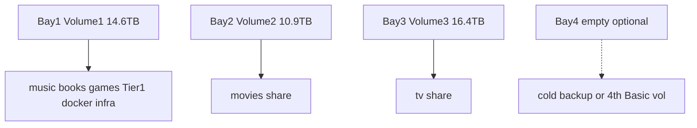
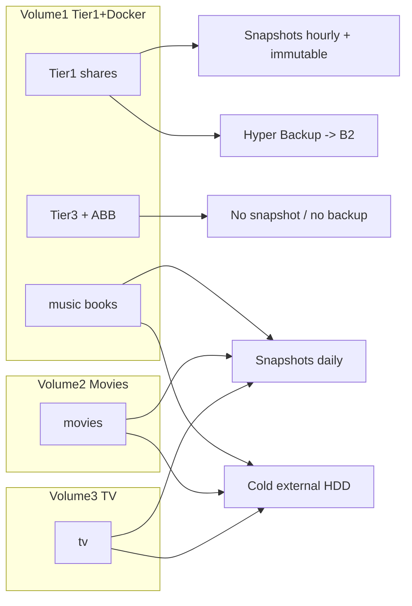

# NAS Storage Schema (DS920+)

A drive / file / storage / network-drive schema for the Synology DS920+, designed to be implemented by hand in DSM. It **retains three independent single-disk Basic storage pools** (one volume per drive, no parity) to maximize usable capacity (~42 TB raw), then lays a shared-folder, network-drive, snapshot, and backup schema on top that maps 1:1 to the services and the Tier 1 / Tier 2 data model in [foss-setup-plan-2.md](foss-setup-plan-2.md) Section 6.

This is the implementable spec; DSM itself is configured by following the [reorganization runbook](#5-reorganization-runbook) at the end.

> **Capacity model — read this first.** Three Basic volumes yield **~42 TB usable** (full raw capacity of all drives — no parity tax). A single drive failure loses **that entire volume** until restore from backup. Tier 1 data still rides Hyper Backup → B2 + snapshots; Tier 2 media rides daily snapshots + a rotated external HDD. Record current USED bytes per volume (`df -h` or Storage Manager) before reorganizing.

---

## Chosen layout (three Basic volumes)

Three independent **Basic** storage pools, one per drive, no parity or mirror between them:

| DSM volume | Usable | Role | Primary consumers |
|------------|--------|------|-------------------|
| **Volume 1** | ~14.6 TB | **Music, Books, Tier 1, Docker, infra** | Lidarr, Readarr/CWA, Immich, Paperless, game saves, rclone mount, manual lane |
| **Volume 2** | ~10.9 TB | **Movies only** | Radarr, Plex Movies library |
| **Volume 3** | ~16.4 TB | **TV only** | Sonarr, Plex TV library |

`md0` (DSM system) and `md1` (swap) mirror across all three drives; only the **data** volumes lack cross-drive protection. That trade-off is intentional — maximum space over RAID redundancy.

> **Why Docker stays on Volume 1:** if your NAS already runs Container Manager from `/volume1/docker/`, keeping Tier 1 + Docker + *arr configs on the same volume avoids a large cross-volume migration. TV moves to the larger Volume 3 (~16.4 TB).

---

## 1. Drive + storage-pool layout

- **Three Basic storage pools** — one per bay (bays 1–3), one Btrfs volume each. **~42 TB total usable.**
- **Volume assignment is fixed by role**, not flexible pooling: TV growth cannot consume movie space (and vice versa) because they live on separate disks.
- **Bay 4 (optional):** a 4th drive can become a **fourth Basic volume** (more capacity) or a **dedicated cold-backup / Tier-1 offload** target — not an SHR expansion path in this schema.
- **`md0` (system) / `md1` (swap)** continue to mirror across member drives automatically; nothing to configure.
- **NVMe (2x M.2 slots):** optional SSD **read/write cache** on Volume 1 (where Immich/Paperless databases live). Default: **skip it** — the 20 GB RAM upgrade (foss-setup-plan-2.md Section 0) covers most of this. Do **not** use the community "NVMe as a storage volume" mod; it is unsupported on the 920+.

### Btrfs / volume settings

- **Filesystem: Btrfs** on all three volumes (required for Snapshot Replication, immutable snapshots, Active Backup dedup).
- **Data checksum: ON** on all volumes (detects bit-rot; without RAID there is no redundant copy to self-heal from — a checksum mismatch means restore from backup).
- **File self-healing: OFF** (or leave default) — self-healing requires redundant copies; Basic volumes do not provide them.
- **Transparent compression: ON** for text/config shares on Volume 1 (`docs`, `appdata`, `vault`); **OFF** for media shares (already-compressed files gain nothing).
- **Record file access time (atime): OFF** for performance.
- **Share-level AES encryption: OFF by default.** Rely on Hyper Backup's client-side encryption for the cloud copy.



---

## 2. Shared-folder schema

Shared folders are grouped by data tier (foss-setup-plan-2.md Section 6). The tier drives snapshot, cloud backup, and whether the data is worth protecting at all.

### Volume 3 — TV (Tier 2)

- **`tv`** — Sonarr root folder `/tv` inside the container; Plex TV library. Replaceable via seedbox; daily snapshot + cold external HDD copy.

### Volume 2 — Movies (Tier 2)

- **`movies`** — Radarr root folder `/movies`; Plex Movies library. Replaceable via seedbox; daily snapshot + cold external HDD copy.

### Volume 1 — Tier 1, Docker, music/books, infra

**Tier 2 — replaceable media** (daily snapshot, cold external HDD; **no cloud**):

- **`music`** — Lidarr root `/music`; Plex Music library; Rhythmbox/libgpod iPod sync master.
- **`books`** — Calibre-Web-Automated organized library (Plex Books); CWA writes here after ingest.
- **`youtube`** — Pinchflat (optional dedicated Plex library or mixed into TV).

**Tier 1 — irreplaceable** (hourly snapshots + immutable lock + Hyper Backup → B2):

- **`photo`** — Immich `UPLOAD_LOCATION`.
- **`docs`** — Paperless-ngx (`consume/`, `media/`, `export/`).
- **`appdata`** — optional compose recipe mirror; `db-dumps/` landing zone.
- **`backups`** — HA backups, DB dumps, archives written *to* the NAS.
- **`vault`** — optional Obsidian vault copy.
- **`home`** — DSM user home folders. Enable User Home service.

**Tier 3 — ephemeral / scratch** (no snapshots, no backup):

- **`staging`** — SD-card / import landing for immich-go.
- **`frigate`** — camera clips.
- **`cache`** — Tdarr / Plex transcode temp.
- **`manual`** — rclone manual-lane destination (non-*arr downloads).
- **`games`** — game-server world saves (LinuxGSM / Pelican).

**Infrastructure** (not SMB-exported):

- **`docker/`** — Container Manager bind-mount roots (`/volume1/docker/<app>/`).
- **`mounts/seedbox-files/`** — rclone FUSE mount of Betty's `files/` tree.
- **`scripts/media/`** — `rclone-*.sh` copies for Task Scheduler.

**Active Backup for Business**

- **`ActiveBackupforBusiness`** on Volume 1 — pull-backups of the CachyOS rig and Ubuntu host. Exclude from Btrfs snapshots (dedup repo).

### Example tree

```text
/volume1/
├── music/                      # Tier2  Lidarr + Plex + iPod sync
├── books/                      # Tier2  CWA library + Plex Books
├── youtube/                    # Tier2  Pinchflat (optional)
├── games/                      # game-server saves
├── manual/                     # rclone manual lane
├── photo/                      # Tier1  Immich
├── docs/                       # Tier1  Paperless
├── appdata/                    # Tier1  db-dumps/ + compose refs
├── backups/                    # Tier1  HA + DB dumps
├── vault/                      # Tier1  Obsidian copy
├── home/                       # Tier1  per-user homes
├── staging/                    # Tier3  import scratch
├── frigate/                    # Tier3  camera clips
├── cache/                      # Tier3  transcode temp
├── docker/                     # infra  Container Manager state
│   ├── media-automation/       # compose project + .env
│   ├── sonarr/ radarr/ .../config
│   └── calibre-web-automated/{config,ingest}
├── mounts/
│   └── seedbox-files/          # infra  rclone FUSE (not a share)
├── scripts/
│   └── media/                  # infra  rclone-*.sh
└── ActiveBackupforBusiness/    # ABB repo (own dedup, no snapshots)

/volume2/
└── movies/                     # Tier2  Radarr + Plex Movies

/volume3/
└── tv/                         # Tier2  Sonarr + Plex TV
```

---

## 3. Network-drive (SMB/NFS) + access schema

### Protocols

- **SMB3** for household clients:
  - Export **`music`** + **`books`** + **`home`** (vol1), **`movies`** (vol2), **`tv`** (vol3). Read for `household`, read/write for `media` service accounts.
  - Optional quota'd **`timemachine`** share on Volume 1.
  - **Disable SMB1**; min SMB2, max SMB3. Enable Bonjour / WS-Discovery.
- **NFS** for Linux hosts (CachyOS rig):
  - Export `music`, `movies`, `tv` **to the Trusted subnet only**, mapped UID/GID, **root squash** on.
- **App access is not SMB.** Immich, Plex, Betty rclone, and Tailscale reach the NAS by their own protocols.

### Network placement

- **VLAN:** NAS lives **only on the Trusted VLAN** (foss-setup-plan-2.md Section 1). Remote reach via **Tailscale** — no port-forwarding.
- **Both 1GbE ports:** LACP bond or SMB Multichannel now that dual-LAN torrent routing is decommissioned.

### Permissions model

- **Groups:**
  - `household` — humans. Read media shares, own `home`.
  - `media` — application service identities. Read/write `tv`, `movies`, `music`, `books`.
- **`docker` service account** — DSM user whose UID/GID is `PUID`/`PGID` in containers; owns `/volume1/docker/` and writes to shares each app needs.
- **Principle:** apps write via service accounts; humans read via `household`. No human write to `docker/` or `frigate`.

---

## 4. Snapshot + backup mapping (3-2-1-1-0)

- **Tier 1** (vol1: `photo`, `docs`, `appdata`, `backups`, `vault`, `home`):
  - Snapshot Replication hourly; immutable snapshots 7–14 days.
  - Nightly Hyper Backup → Backblaze B2 (Object Lock, client-side encrypted).
- **Tier 2** (vol3 `tv`, vol2 `movies`, vol1 `music`, `books`, `youtube`):
  - Daily snapshot, short retention.
  - One **cold copy to rotated external HDD** covering **all four media locations** (off-site). No cloud.
- **Tier 3** + ABB: no snapshots, no backup.
- **Database safety:** nightly `pg_dump` into `/volume1/docker/<app>/backups/` or `/volume1/appdata/db-dumps/` before the Hyper Backup window.



---

## 5. Reorganization runbook

Chosen path: **keep three Basic pools; split content across volumes.** Docker **stays on Volume 1**. No SHR rebuild. Sequence after Phase-1 safety net (Tailscale + B2) exists.

0. **Pre-flight.** Record USED bytes per volume (`df -h`). Confirm TV fits on vol3 (~16.4 TB), movies on vol2 (~10.9 TB), music/books/Tier 1/docker on vol1 (~14.6 TB). Prune with **Maintainerr** if any volume is over capacity.
1. **Safety net.** Tailscale on NAS; B2 bucket with Object Lock; Hyper Backup ready.
2. **Wipe volumes 2 & 3** (if unorganized). Delete shares on vol2 and vol3; recreate empty Basic volumes. **Leave Volume 1 untouched** — Docker and Tier 1 likely already live here.
3. **Create shares** on all three volumes per Section 2; apply Btrfs settings (Section 1); configure groups/permissions (Section 3).
4. **Split Volume 1** (when everything currently lives there):
   - Identify the TV / movies / music / books roots from your path map (nas-00a).
   - `rsync -avh`: **movies** → `/volume2/movies/`, **TV** → `/volume3/tv/`, **music** → `/volume1/music/`, **books** → `/volume1/books/`.
   - **Keep** Tier 1 + `docker/` + `mounts/` + `scripts/` on Volume 1 (organize into the share tree if still flat).
   - Verify **rsync integrity** (`du -sb`, `rsync -avhn --delete` dry-run) — **do not delete vol1 duplicates yet.**
5. **Export SMB/NFS** (nas-00d) so clients can reach the new paths.
6. **Re-point consumers, then prune:**
   - **Today (Ubuntu):** mount NFS at stable paths; re-point Plex + Sonarr/Radarr/Lidarr bind mounts and library/root folders; confirm playback/import; **then** delete old vol1 duplicates (tracker: nas-00e).
   - **Later (NAS):** when Plex lands (nas-10) and the media-automation stack lands (nas-21+), point those containers at the **same** share paths — no second data move; confirm `.env` paths in `configs/nas/media-automation/.env.example` and *arr root folders (`/tv`, `/movies`, `/music`, `/cwa-book-ingest`).
7. **Protection:** Snapshot Replication on Tier 1 (vol1); daily snapshots on `tv`, `movies`, `music`; Hyper Backup → B2; external HDD job for all Tier 2 paths. **Test one restore.**

---

## Risks / assumptions

- **No RAID:** a dead drive loses that volume entirely. Mitigate with B2 (Tier 1), external HDD (Tier 2), and seedbox re-acquisition (media).
- **Fixed volume sizes:** TV cannot borrow space from movies. Monitor `df -h` per volume; prune or add bay-4 drive if a library outgrows its disk.
- **Cross-volume *arr imports:** Betty → rclone → Deluge import is already a cross-filesystem **copy** (not a hardlink) — splitting volumes does not change that pipeline.
- **If you later want redundancy:** migrating to SHR-1 requires deleting all three pools and rebuilding (~28 TB usable) — see Synology docs; back up Tier 1 first.

---

## Appendix: SHR-1 alternative (not chosen)

Pooling all three drives into one SHR-1 Btrfs volume yields **~28 TB usable** with 1-disk fault tolerance. DSM cannot convert Basic pools in place — it is a destructive rebuild. This schema deliberately keeps three Basic volumes for **~42 TB** capacity instead.
