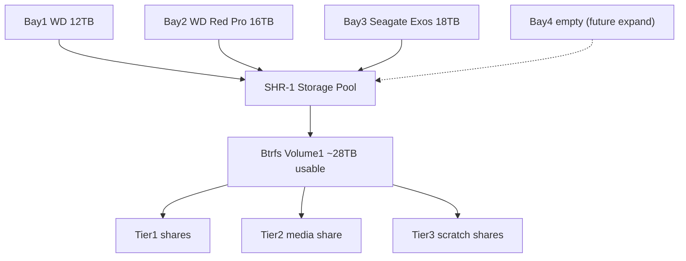
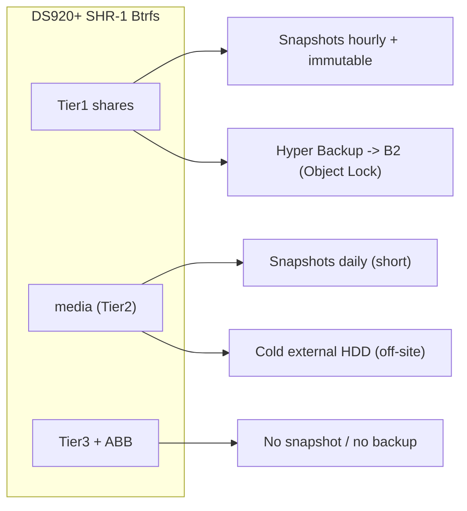

# NAS Storage Schema (DS920+)

A drive / file / storage / network-drive schema for the Synology DS920+, designed to be implemented by hand in DSM. It replaces the current three independent single-disk **Basic** volumes (no redundancy) with one redundant **SHR-1 Btrfs pool**, then lays a shared-folder, network-drive, snapshot, and backup schema on top that maps 1:1 to the services and the Tier 1 / Tier 2 data model in [foss-setup-plan-2.md](foss-setup-plan-2.md) Section 6.

This is the implementable spec; DSM itself is configured by following the [migration runbook](#5-migration-runbook-destructive) at the end.

> **Pre-flight capacity check — do this first.** SHR-1 across these three drives yields **~28TB usable** (down from 46TB raw across the current Basic volumes), because ~18TB goes to parity. Record current USED bytes per volume *before* you start. If your media is anywhere near or above ~26TB, the ~28TB ceiling is tight: either install the **bay-4 drive first** (it grows the pool online) or prune with **Maintainerr** (foss-setup-plan-2.md Section 2, media companion layer) before migrating. Everything below assumes the library fits inside ~28TB after this check.

---

## Current state (what we're replacing)

Three independent **Basic** volumes, one per drive, no parity or mirror between them:

| Bay | Device | Drive | Current volume |
|---|---|---|---|
| 1 (`sata1`) | `WD120EMFZ` | WD 12TB Red Plus, 5400-class, CMR | Volume 2 (`md3` -> `vg2`) |
| 2 (`sata2`) | `WD161KFGX` | WD Red Pro 16TB, 7200 RPM, CMR | Volume 1 (`md2` -> `vg1`) |
| 3 (`sata3`) | `ST18000NM002J` | Seagate Exos (X18) 18TB, 7200 RPM, CMR | Volume 3 (`md4` -> `vg3`) |

`md0` (DSM system) and `md1` (swap) already mirror across all three drives; only the **data** volumes lack protection. A drive failure today loses that whole volume until a restore from backup. The schema below changes that.

---

## 1. Drive + storage-pool layout

- **One SHR-1 storage pool** spanning all three drives (bays 1-3). Usable **~28TB**, **1-disk fault tolerance** — Plex, Immich, and HA stay online through any single drive failure and the pool rebuilds onto a replacement.
- **One Btrfs volume** on the pool. Do *not* carve multiple volumes — a single volume keeps space flexible; organize with shared folders and (optional) per-share quotas instead.
- **Bay 4 reserved for expansion.** Dropping a 4th drive into the empty bay later and choosing **Storage Manager -> Storage Pool -> Add Drive** grows the SHR-1 pool **online**, adding capacity while preserving redundancy. This is the primary capacity escape hatch.
- **`md0` (system) / `md1` (swap)** continue to mirror across all member drives automatically; DSM recreates them when the pool is rebuilt — nothing to configure.
- **NVMe (2x M.2 slots):** optional SSD **read/write cache** (uses both slots so the write cache is redundant) to accelerate the random IO of the Immich/Plex/Paperless databases. Default: **skip it** — the 20GB RAM upgrade (foss-setup-plan-2.md Section 0) covers most of this. Do **not** use the community "NVMe as a storage volume" mod; it is unsupported on the 920+ and works against the set-and-forget goal.

### Btrfs / volume settings

- **Filesystem: Btrfs** (required for Snapshot Replication, immutable snapshots, Active Backup dedup, and self-healing).
- **Data checksum + file self-healing: ON.** Self-healing corrects bit-rot from the redundant copy — this only works because SHR-1 provides redundancy, so it's a real win here.
- **Transparent compression: ON** for text/config shares (`docs`, `appdata`, `vault`); **OFF** for `media` (already-compressed files gain nothing).
- **Record file access time (atime): OFF** for performance.
- **Share-level AES encryption: OFF by default.** Rely on Hyper Backup's client-side encryption for the cloud copy. If you want at-rest encryption on `docs`/`home`, note the trade-offs: you must safely escrow the key (Bitwarden + printed copy), the share auto-unmounts on reboot until re-keyed, and some features (e.g., certain replication paths) are restricted.



---

## 2. Shared-folder schema

Shared folders are grouped by the data tier they belong to (foss-setup-plan-2.md Section 6). The tier drives every downstream policy — snapshots, cloud backup, and whether the data is worth protecting at all.

### Tier 1 — irreplaceable

Frequent + immutable snapshots; Hyper Backup -> Backblaze B2 with Object Lock.

- **`photo`** — Immich `UPLOAD_LOCATION`. Immich creates `library/`, `upload/`, `thumbs/`, `encoded-video/`, `profile/`, `backups/` inside it.
- **`docs`** — Paperless-ngx (`consume/`, `media/`, `export/`) plus any directly-scanned documents.
- **`appdata`** — the Docker control plane: compose files, per-app config and volumes, database data directories, and `db-dumps/` (nightly `pg_dump` landing zone). Backing this up = the apps are rebuildable.
- **`backups`** — Samba/NFS target for Home Assistant backups, database dumps, and miscellaneous app backup archives written *to* the NAS.
- **`vault`** — optional Obsidian vault copy (Syncthing target). Obsidian Sync remains primary; this is a belt-and-suspenders local copy that rides the Tier 1 backup.
- **`home`** — DSM user home folders (per-user personal files). Enable User Home service.

### Tier 2 — replaceable media

RAID redundancy + one cold external copy. **No cloud backup** (re-acquirable via the seedbox).

- **`media`** — a single share with subfolders. Keep it as **one** share so the seedbox's atomic moves / hardlinks work and every reader (Plex, Navidrome, Calibre-Web-Automated, Pinchflat) points at one root.
  - `movies/` — Plex/Radarr
  - `tv/` — Plex/Sonarr
  - `music/` — Navidrome/Lidarr
  - `youtube/` — Pinchflat (a dedicated Plex library or mixed into TV)
  - `audiobooks/`
  - `books/` — Calibre library / Calibre-Web-Automated

### Tier 3 — ephemeral / scratch

No snapshots, no backup. High-churn or trivially re-created data.

- **`staging`** — SD-card / import landing for immich-go / pbak, watched-folder ingest, and download scratch.
- **`frigate`** — Frigate recordings and clips (continuous writes, large, churny). Keep off snapshots and off the cloud.
- **`cache`** — Tdarr transcode cache and Plex transcode temp. (If you ever add the NVMe cache, this is the natural thing to put on it.)

### Active Backup for Business

- **`ActiveBackupforBusiness`** — DSM-managed share holding pull-backups of the CachyOS rig and the Ubuntu (Mac mini) host. It has its own deduplication, so **exclude it from Btrfs snapshots** (snapshotting a dedup repo wastes space). It's a backup target, not primary data.

### Example tree

```text
/volume1
├── photo/            # Tier1  Immich (library/ upload/ thumbs/ encoded-video/ profile/)
├── docs/             # Tier1  Paperless (consume/ media/ export/) + scans
├── appdata/          # Tier1  docker/<app>/ + db-dumps/
├── backups/          # Tier1  HA backups, DB dumps, archives
├── vault/            # Tier1  Obsidian copy (optional)
├── home/             # Tier1  per-user homes
├── media/            # Tier2  movies/ tv/ music/ youtube/ audiobooks/ books/
├── staging/          # Tier3  import/ingest scratch
├── frigate/          # Tier3  camera clips
├── cache/            # Tier3  transcode cache/temp
└── ActiveBackupforBusiness/   # ABB repo (own dedup, no snapshots)
```

---

## 3. Network-drive (SMB/NFS) + access schema

### Protocols

- **SMB3** for household clients (the wife's laptop, Macs, the rig if you prefer SMB):
  - Expose `media` (read for the `household` group, read/write for media service accounts), `home`, and an optional quota'd **`timemachine`** share for Mac Time Machine (set "Enable Time Machine" + a quota so it can't eat the pool).
  - **Disable SMB1**; set min protocol SMB2, max SMB3. Enable **Bonjour / WS-Discovery** so Macs and Windows see the NAS. Keep opportunistic locking on.
- **NFS** for Linux hosts (the CachyOS rig) wanting direct, low-overhead access:
  - Export `media` (and `staging` if needed) **to the Trusted subnet only**, with mapped UID/GID and **root squash** on.
- **App access is not SMB.** The seedbox sync (Syncthing / SFTP), the Immich mobile app, and Plex all reach the NAS over Tailscale / their own protocols — don't plumb those through SMB shares.

### Network placement

- **VLAN:** the NAS lives **only on the Trusted VLAN** (foss-setup-plan-2.md Section 1). SMB/NFS is never served to IoT or Guest. Remote reach is via **Tailscale** installed on the NAS — no port-forwarding.
- **Both 1GbE ports:** now that the old dual-LAN / Gluetun torrent routing is decommissioned (foss-setup-plan-2.md Section 2), the freed second port can be used for an **LACP bond** or **SMB Multichannel** for throughput and link failover.

### Permissions model

- **Groups:**
  - `household` — humans (you + wife). Read `media`, own their `home`.
  - `media` — application service identities. Read/write `media`.
- **`docker` service account** — a dedicated DSM user whose UID/GID is passed to Container Manager containers as `PUID`/`PGID`, owning `appdata` and writing to the shares each app needs.
- **Principle:** apps write via service accounts; humans read via the `household` group. No human account needs write to `appdata` or `frigate`.

---

## 4. Snapshot + backup mapping (3-2-1-1-0)

Three copies, two media, one off-site, one immutable, zero restore errors (verified). Per-tier policy:

- **Tier 1** (`photo`, `docs`, `appdata`, `backups`, `vault`, `home`):
  - **Snapshot Replication** hourly, retain roughly 24 hourly / 7 daily / 4 weekly.
  - Enable **immutable / locked snapshots** (DSM 7.2+) so even an admin can't delete a point-in-time early (ransomware defense).
  - Nightly **Hyper Backup -> Backblaze B2**, into a bucket with **Object Lock** enabled, **client-side encrypted** (key in Bitwarden + printed copy).
- **Tier 2** (`media`):
  - **Daily** snapshot, **short** retention (accidental-delete safety only).
  - One **cold copy to a rotated external HDD** (kept off-site at an office / relative's). **No cloud** — it's re-acquirable.
- **Tier 3** (`staging`, `frigate`, `cache`) and the ABB share: **no snapshots, no backup**.
- **Database safety:** a nightly `pg_dump` of every Postgres app (Immich's VectorChord, Paperless, etc.) writes into `appdata/db-dumps/` **before** the Hyper Backup window, so the off-site copy captures a consistent dump rather than a hot, half-written DB file. SQLite apps use the SQLite `.backup` command, not a raw file copy.



---

## 5. Migration runbook (destructive)

Chosen path: **offload Tier 1, re-acquire media.** Going from three Basic volumes to one SHR-1 pool is inherently destructive — DSM cannot convert single-disk Basic pools into a shared SHR-1 pool in place — so all three drives are wiped and re-pooled. Sequence it *after* the Phase-1 safety net exists.

0. **Pre-flight capacity check.** Record current USED bytes per volume (Storage Manager, or `df -h` over SSH). Confirm the library fits inside ~28TB; if not, install the bay-4 drive first or prune with Maintainerr. (See the banner at the top.)
1. **Safety net.** Stand up the foss-setup-plan-2.md Phase-1 items: Tailscale on the NAS, and a Backblaze B2 bucket ready (Object Lock on).
2. **Offload Tier 1 (~1-2TB).** Copy it to an external USB drive **and** run a Hyper Backup / Restic job to B2. **Verify a test restore** before proceeding — this is the only protected copy during the wipe.
3. **Media decision.** Re-acquire via the seedbox after rebuild (chosen). *Optional:* also copy `media` to an external drive now to skip the re-download.
4. **Delete the three Basic storage pools** (`md3`/`md2`/`md4` -> `vg2`/`vg1`/`vg3`) in Storage Manager. The system/swap arrays (`md0`/`md1`) rebuild automatically.
5. **Create one SHR-1 pool** across all three drives; create **one Btrfs volume** on it.
6. **Create the shared folders** from Section 2; apply the Btrfs/compression/snapshot settings (Section 1) and the groups/permissions (Section 3).
7. **Restore Tier 1** from the external drive / B2 into the new shares; re-point Container Manager bind mounts at the new `appdata` / share paths.
8. **Re-acquire media** via the seedbox *arrs into `media/` (or copy back from the optional external copy).
9. **Configure protection:** Snapshot Replication (+ immutable) on Tier 1, Hyper Backup -> B2 (Object Lock), Active Backup for Business for the rig + Ubuntu box, and the cold external copy of `media`. **Test one restore** — that's the "0" (zero restore errors) in 3-2-1-1-0.

---

## Risks / assumptions

- **Capacity drop:** 28TB usable vs 46TB raw today. Mitigations: bay-4 online expansion and Maintainerr pruning.
- **Destructive rebuild:** NAS services are down during the migration window; only run it once the Phase-1 safety net and a verified Tier 1 offload exist.
- **Media re-acquisition:** re-pulling a large library via the seedbox costs time/bandwidth; the optional external copy in step 3 avoids it.
- **Unsupported tweaks excluded:** NVMe-as-storage and other community mods are deliberately left out for set-and-forget reliability.
